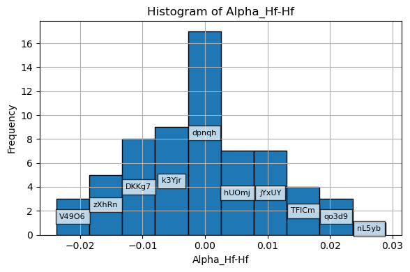
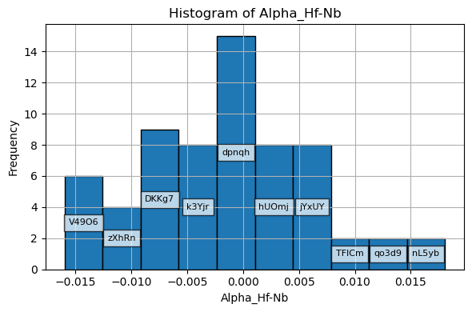
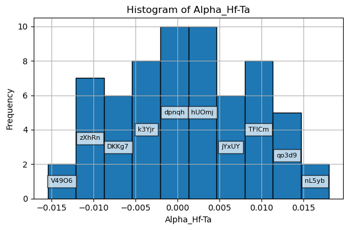
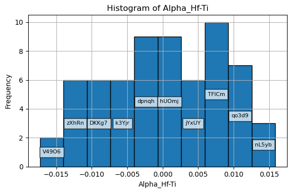

# MoSHEAHu

MoSHEAHu is a workflow for generating chemically disordered high-entropy alloy structures, running atomistic simulations, and analyzing Warren-Cowley short-range order metrics with Python-based postprocessing.

The project combines structure generation, simulation setup, compiled analysis tools, and notebook-based visualization in a single reproducible repository.

## Repository Layout

- `workflow_and_analysis.ipynb` - main notebook for generation, analysis, and plotting
- `executables/` - compiled and source analysis tools such as `wc_calc` and `WarrenCowley.cpp`
- `input_files/` - simulation input templates
- `potentials/` - potential files used in the simulations
- `simulations/` - simulation folders and outputs
- `utils/` - helper modules for structure generation, parameter setup, and plotting
- `assets/` - exported figures used by the README

## Requirements

Install the main Python dependencies used by the notebook:

```bash
python -m pip install numpy matplotlib seaborn ase
```

## Run The Workflow

From the project root:

```bash
cd /Users/dajuarez4/Documents/MoSHEAHu
jupyter notebook workflow_and_analysis.ipynb
```

If needed, compile the Warren-Cowley executable:

```bash
cd /Users/dajuarez4/Documents/MoSHEAHu/executables
g++ -std=c++11 WarrenCowley.cpp -o wc_calc
```

## Example Results

The notebook produces publication-style plots for Warren-Cowley parameter distributions and structure/composition analysis.

### Example plot 1



### Example plot 2



### Example plot 3



### Example plot 4




## Notes

- The notebook uses local helper modules from `utils/`.
- Simulation-specific paths and parameters are configured inside the notebook and utility modules.
- The README figures are exported from notebook outputs so the results are visible directly on GitHub.
